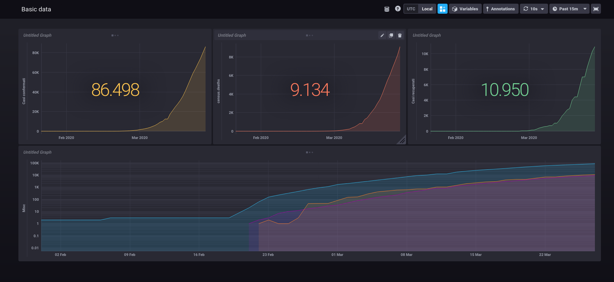

# Description

Elixir/OTP application fetching CoVID-19 data relating Italy.
Data is stored in an InfluxDB database.

The API used to fetch the data is https://github.com/backtrackbaba/covid-api

The application consists of 3 fundamental components:

- __DateRangeGenerator__, generates the date ranges to query the API (generate ranges of 5 days)
- __DatesProcessor__, processes the ranges generated by _DateRangeGenerator_ and queries the API
- __StatsProcessor__, processes the data fetched by _DatesProcessor_ and stores them in the InfluxDB

All the components communicate via RabbitMQ channels, in particular:

- __`dates_queue`__ is used for the communication between _DateRangeGenerator_ and _DatesProcessor_
- __`bulk_data`__ is used for the communication between _DateProcessor_ and _StatsProcessor_

## More details..

Consumers (_DatesProcessor_ and _StatsProcessor_) are defined using Broadway and Broadway-RabbitMQ.
Specifically:

- _DatesProcessor_ spawns 5 processes to process data
- _StatsProcessor_ spawns 5 processes to process data

# Setting up the infrastructure

You can find a `docker-compose.yaml` file in ./docker-compose folder into this repo to setup everything (see Running the application).

Otherwise:

- RabbitMQ should run on `localhost:5672`
- InfluxDB should run on `localhost:8086`

# Running the code

## Requirements
You must have installed Elixir (>= 1.9) to run the application. 
Docker and Docker Compose are a must to build InfluxDB, Chronograf and RabbitMQ containers from the `docker-compose.yaml` file.

## Running the application

First you to run RabbitMQ and InfluxDB:

```
cd docker-compose
docker-compose up -d
```
This will create three container:

- RabbitMQ on `localhost:5672`
- InfluxDB on `localhost:8086`
- Chronograf on `localhost:8888`

To launch the application (in the repo root folder):

```
mix deps.get
iex -S mix

... logs ...

iex(1)> Covid19Influx.DateRangeGenerator.generate_dates()
```

And the application will start fetching data and processing it.

# Visualizing data

You can use Chronograf to visualize your data. In the ./chronograf folder you can find a dashboard export. It will look like this:



# Disclaimer
I wrote the application just to try out few technologies.
I don't know if using all the tools used here is overkilling for the task.
